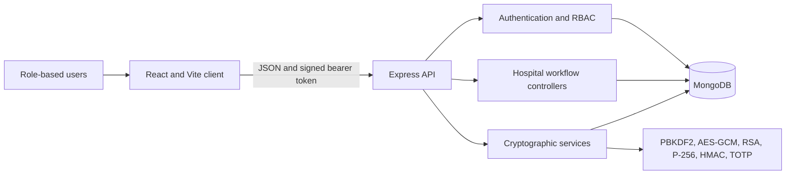

# MediSecure

MediSecure is an encrypted, role-based hospital management system built for
CSE447: Cryptography and Cryptanalysis. It combines hospital workflows with
application-level cryptography, patient-controlled record sharing, two-factor
authentication, signed sessions, and server-side authorization.

The application has a React and Vite frontend, an Express API, and MongoDB
storage. Patients, doctors, administrators, donors, ambulance drivers, and
hospital staff receive separate dashboards and permissions.

> This is an academic project. Use disposable data for demonstrations and do
> not commit `.env` files, private keys, database credentials, or authenticator
> secrets.

## Features

| Area | Available workflows |
| --- | --- |
| Patient | Book and cancel appointments, view prescriptions and test reports, make payments, request ambulances or blood, manage profile security, enable 2FA, and approve or reject old-record access |
| Doctor | Maintain specialization and appointment slots, review assigned patients, search medicine and test catalogs, create prescriptions and reports, and request access to older records |
| Administrator | Verify or remove users and manage staff schedules without receiving a medical-record decryption route |
| Blood donation | Match donors with requests and track accepted or completed donations |
| Ambulance | Submit patient requests and let verified drivers accept and complete assigned trips |
| Staff | Provide category-specific dashboards for receptionists, nurses, and ward staff |
| Reception | Look up patients and manage cabin, ICU, or OT reservations |

## Security Design

MediSecure uses Node.js built-in `crypto` primitives rather than third-party
password, token, or encryption packages.

| Security goal | Implementation |
| --- | --- |
| Password storage | PBKDF2-HMAC-SHA256 with 120,000 iterations, a random 16-byte salt, and constant-time verification |
| Field encryption | AES-256-GCM with random IVs and an additional HMAC-SHA256 integrity value |
| Metadata protection | RSA-2048 OAEP-SHA256 hybrid envelopes that wrap random AES content keys |
| Clinical-data protection | P-256 ECDH, HKDF-SHA256, AES-256-GCM, and HMAC-SHA256 in an ECIES-style envelope |
| Private-key storage | Per-user RSA and P-256 private keys wrapped with password-derived AES-256-GCM keys |
| Two-factor authentication | RFC 6238 TOTP with a protected 160-bit Base32 secret, 30-second steps, and six-digit codes |
| Session authentication | RSA-SHA256 signed `header.payload.signature` tokens with expiry and purpose checks |
| Patient consent | ECDSA P-256 approval signatures and fresh doctor-specific RSA/ECC record envelopes |
| Authorization | Authentication, verification, role, staff-category, ownership, and assignment checks on the server |

Passwords are hashed and never decrypted. Public keys are stored normally;
private keys are never stored as plaintext. An authenticated password change
rewraps the same private keys, while a forgotten-password reset rotates keys
and disables 2FA because the old password-derived wrapping key is unavailable.



## Technology Stack

- Frontend: React 19, React Router, Axios, Tailwind CSS, Vite
- Backend: Node.js, Express 5, Mongoose
- Database: MongoDB or MongoDB Atlas
- Cryptography: Node.js built-in `node:crypto`
- Tests: Node.js built-in test runner

## Repository Structure

```text
HMS/
  client/                    React and Vite frontend
    src/pages/               Public pages and role dashboards
    src/components/          Shared workflow and security UI
    src/api/                 Axios API clients
  server/                    Express and MongoDB backend
    controllers/             Hospital workflows and encryption call sites
    middleware/              Authentication, verification, and RBAC
    models/                  Mongoose schemas and protected fields
    routes/                  API route definitions
    utils/                   Password, AES, RSA, ECC, HMAC, TOTP, and token code
    scripts/                 Crypto setup, migration, and admin utilities
    seed/                    Optional catalog and demonstration data
    tests/                   Cryptographic and RBAC tests
  docs/                      Proposal mapping and implementation guides
```

## Prerequisites

- Node.js and npm
- MongoDB running locally or a MongoDB Atlas connection string
- Two terminal windows for running the API and frontend together

The frontend and backend are separate npm projects. Run `npm install` in both
`client` and `server`; the root directory is not an npm workspace.

## Local Setup

### 1. Clone and install the backend

```bash
git clone https://github.com/Nirban1-1/Hospital_MS.git
cd Hospital_MS/server
npm install
```

Create `server/.env` with the non-secret application settings first:

```dotenv
MONGO_URI=mongodb://127.0.0.1:27017/medisecure
PORT=5000
NODE_ENV=development
ENCRYPTION_KEY=PASTE_A_64_CHARACTER_HEX_KEY_HERE
```

Generate a random 32-byte field-encryption key:

```bash
node -e "console.log(require('node:crypto').randomBytes(32).toString('hex'))"
```

Paste that output into `ENCRYPTION_KEY`, then generate the RSA session-signing
keys without printing them to the terminal:

```bash
npm run crypto:setup
```

`crypto:setup` writes any missing `SESSION_PRIVATE_KEY` and
`SESSION_PUBLIC_KEY` values directly to `server/.env`. Keep the same
`ENCRYPTION_KEY` after storing data; replacing it makes existing `enc:v2`
fields unreadable.

For an older database that previously relied on the `JWT_SECRET` fallback,
preserve that value and follow the migration guide before changing any key.

### 2. Install and configure the frontend

```bash
cd ../client
npm install
```

Create `client/.env`:

```dotenv
VITE_API_URL=http://localhost:5000/api
```

### 3. Start the application

Run the API from the first terminal:

```bash
cd server
npm run dev
```

Run the frontend from the second terminal:

```bash
cd client
npm run dev
```

Open `http://localhost:5173`. The API health check is available at
`http://localhost:5000/`.

The backend CORS configuration permits the local frontend on port `5173`.
Update `allowedOrigins` in `server/server.js` before using another frontend
origin.

## Administrator Setup

There is no hard-coded or default administrator password. Add the following to
`server/.env`:

```dotenv
ADMIN_EMAIL=admin@example.com
ADMIN_PASSWORD=USE_A_UNIQUE_PASSWORD_WITH_AT_LEAST_12_CHARACTERS
ADMIN_NAME=System Administrator
```

Then run from `server`:

```bash
npm run admin:upsert
```

The command creates the admin when it does not exist and securely replaces the
password and key material when updating an existing admin.

## Optional Seed Data

Add a demonstration doctor password of at least 12 characters to `server/.env`
before seeding doctors:

```dotenv
DEMO_DOCTOR_PASSWORD=USE_A_DISPOSABLE_12_PLUS_CHARACTER_PASSWORD
```

Run only the data sets needed for the demonstration:

```bash
npm run seed:doctors
npm run seed:doctor-slots
npm run seed:medicines
npm run seed:test-catalog
```

Seed commands require a working `MONGO_URI` and should not be run blindly
against a production database.

## Existing-Data Encryption Migration

The proposal-aligned migration is additive and skips records that are already
protected. Back up the database and run the dry audit first:

```bash
cd server
npm run crypto:migrate
```

Review the counts, then apply the migration explicitly:

```bash
npm run crypto:migrate:apply
```

The migration does not invent user private keys. Legacy users without keypairs
must complete one password reset before their remaining owner-specific
envelopes can be created.

## Tests and Build

Run the complete backend cryptography and authorization suite:

```bash
cd server
npm test
```

Run only the cryptographic tests:

```bash
npm run test:crypto
```

The complete suite currently contains 13 tests covering PBKDF2, RSA-OAEP,
hybrid RSA envelopes, P-256 ECDH/ECDSA, HMAC tamper detection, private-key
rewrapping, TOTP, signed sessions, and RBAC boundaries.

Create a production frontend build:

```bash
cd client
npm run build
```

## Main API Groups

| Prefix | Responsibility |
| --- | --- |
| `/api/users` | Registration, login, profile, password lifecycle, 2FA, and patient prescriptions |
| `/api/appointment` | Specializations, doctors, schedules, booking, and cancellation |
| `/api/doctor` | Doctor dashboard, specialization, slots, prescriptions, and patient history |
| `/api/medicines`, `/api/tests`, `/api/test-reports` | Clinical catalogs and report workflows |
| `/api/record-access` | Patient-controlled old-record request, approval, rejection, and decryption |
| `/api/blood`, `/api/donor` | Blood requests, matching, availability, and donation history |
| `/api/ambulance`, `/api/driver` | Ambulance requests and driver actions |
| `/api/reception`, `/api/staff`, `/api/admin` | Reservations, staff schedules, verification, and administration |
| `/api/payment`, `/api/chatbot` | Prescription payment and patient chatbot workflows |

Protected requests use this header:

```http
Authorization: Bearer <signed-session-token>
```

## Documentation

- [Proposal compliance and lab guide](docs/encryption-proposal-compliance.md)
- [Encryption implementation notes](docs/encryption-implementation-notes.md)
- [Encryption learning guide](docs/MediSecure_Encryption_Implementation_Learning_Guide.md)
- [Manual verification and demonstration guide](docs/MediSecure_Manual_Encryption_Verification_and_Demonstration_Guide.md)
- [Code-level encryption explanation](docs/MediSecure_Code_Level_Encryption_Explanation.md)

## Troubleshooting

| Message or symptom | Resolution |
| --- | --- |
| `ENCRYPTION_KEY is not set or invalid` | Add a 64-character hexadecimal key to `server/.env`, then restart the API. Do not replace the key for an existing encrypted database. |
| `SESSION_PRIVATE_KEY and SESSION_PUBLIC_KEY are required` | Run `npm run crypto:setup` from `server` and restart the API. |
| `Set ADMIN_EMAIL to a valid email address` | Define `ADMIN_EMAIL`, `ADMIN_PASSWORD`, and optionally `ADMIN_NAME` in `server/.env`; the password must have at least 12 characters. |
| Two-factor setup expired | Start 2FA setup again, scan the new secret, and immediately confirm with a fresh authenticator code. Keep the computer and phone clocks synchronized. |
| Doctor, medicine, or test lists are empty | Confirm MongoDB is connected and run the corresponding optional seed command. |
| Browser reports a CORS error | Use `http://localhost:5173` or add the actual frontend origin to `allowedOrigins` in `server/server.js`. |

## Production Checklist

- Set `NODE_ENV=production`.
- Store `MONGO_URI`, `ENCRYPTION_KEY`, and session keys in the deployment
  platform's secret manager.
- Keep a backed-up, stable `ENCRYPTION_KEY`; do not generate a new value during
  each deployment.
- Restrict CORS to the deployed frontend origin and serve the application over
  HTTPS.
- Never deploy demonstration accounts or seed passwords.
- Run `npm test`, create the frontend build, and dry-run encryption migrations
  before release.
